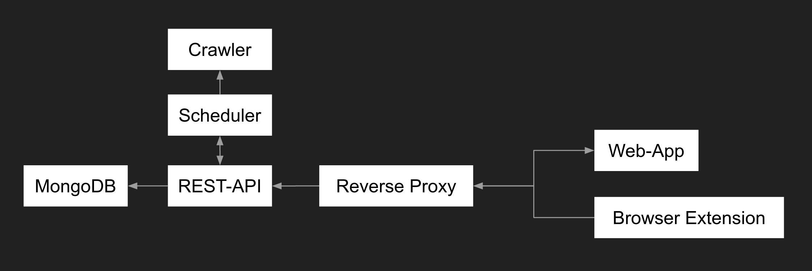

# Preiswecker

## Installation
1. Install `docker` and `docker-compose`
2. Copy `.env.example` to `.env`
3. Run application with `docker-compose up`
4. Visit `https://localhost` to use the application

## Components
The application is made up of the components listed below:

### Crawler
Responsible for crawling geizhals.de API
### Scheduler
Schedules background tasks, such as checking if a product fell below a certain price
### REST-API
Application core that does user-management, authentication and alerting. Only component with database access.
The public endpoint is https://preiswecker.spyfly.xyz/api
### MongoDB
Storage of user-data and alerts
### Reverse Proxy
SSL-Termination and exposing the frontend and the public parts of the rest-api publicly
### Web App
The website, which can be accessed under https://preiswecker.spyfly.xyz
### Browser Extension
Allows users to directly create price-alerts from the geizhals.de website.

## Documentation
For a more detailed documentation visit the [_docs](_docs/README.md) folder