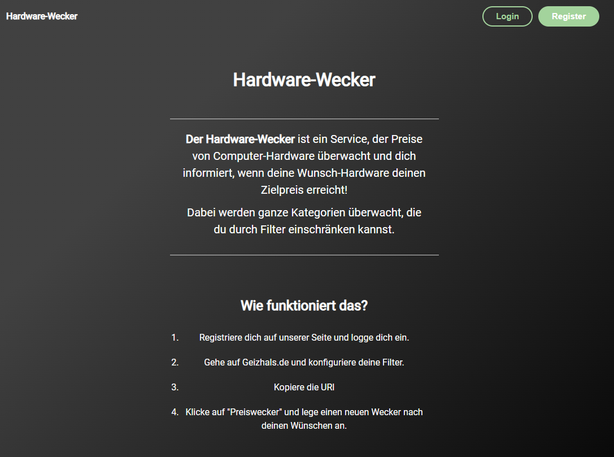
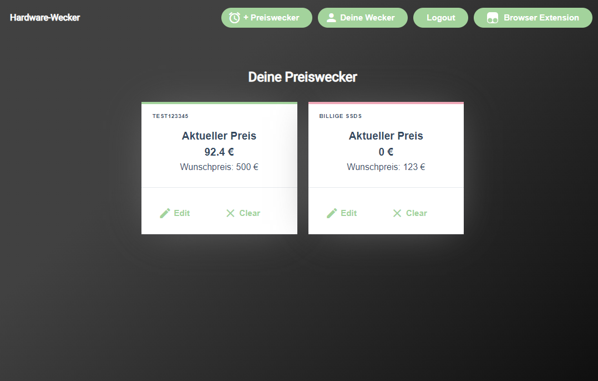
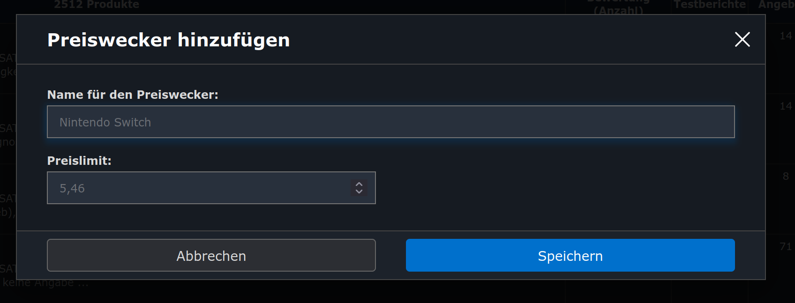

# Bedienungsanleitung für Clients
## Browser Frontend

- Registriere dich auf unserer [Seite](https://preiswecker.spyfly.xyz) und logge dich ein.
- Gehe auf Geizhals.de und konfiguriere deine Filter. (z.B. https://geizhals.de/?cat=hdssd&xf=252_1920%7E4832_3)
- Kopiere die URL
- Klicke auf "Preiswecker" und lege einen neuen Wecker nach deinen Wünschen an.
- Du solltest nun eine E-Mail bekommen, sobald dein Wunschpreis für die Kategorie erreicht ist

## Browser Erweiterung
### Installation
- Installation von [Tampermonkey](https://tampermonkey.net)
- Installation des Browser Scripts ([von der Website](https://preiswecker.spyfly.xyz/static/preiswecker.user.js))

### Nutzung
- Erstellung eines Nutzerkontos und anschließender Login auf der [Website](https://preiswecker.spyfly.xyz)
- Aufrufen einer Geizhals.de Kategorien Seite, z. B. [Intel CPUs](https://geizhals.de/?cat=cpu1151)
- Klicken des `Preisalarm hinzufügen` Buttons
- Setzen der Parameter im Erweiterungs-Popup
  