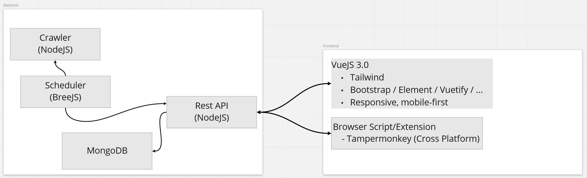
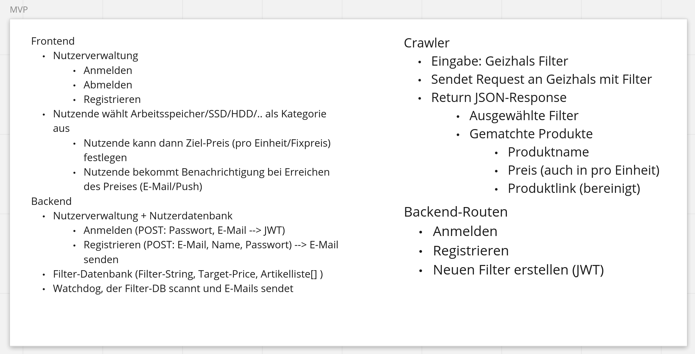

# Vorgehensweise
1. Brainstorming mit Miro

2. Festlegen eines MVP

3. Aufteilen der einzelnen Komponenten in Arbeitspakete
   - Crawler
   - CI/CD Pipeline mit Docker-Compose (Vorrausetzung für Build und Deployment der Komponenten)
   - Rest-API (benötigt Crawler und MongoDB)
   - Frontend (benötigt Rest-API)
   - Scheduler (benötigt REST-API)
   - Reverse Proxy (benötigt REST-API und Frontend)
   - Browser Extension (benötigt REST-API)
4. Arbeiten an Paketen und regelmäßige Treffen
   - Instant Messaging Gruppe für schnelle Kommunikation
   - Discord für Kollaboration und Kommunikation während der Entwicklung